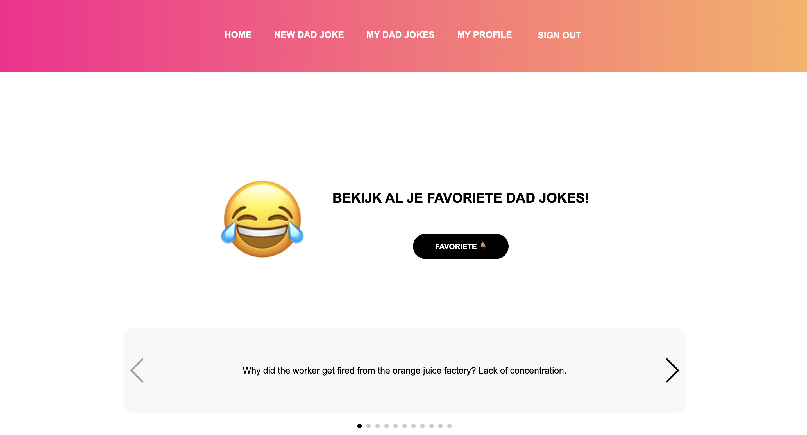

# Dad Jokes App – README
**Laura van Heeswijk – NOVI Hogeschool**

GitHub repository: [https://github.com/LauravanHeeswijk/EindopdrachtFro](https://github.com/LauravanHeeswijk/EindopdrachtFro)

---

## Inleiding

Deze React-app toont elke keer een nieuwe Dad Joke via een externe grap-API. Gebruikers kunnen inloggen, registreren, grappen opslaan als favoriet en profielgegevens bewerken. De applicatie is gebouwd met React en Vite, en werkt met token-authenticatie via een externe backend.



---

## Benodigdheden

Om deze applicatie lokaal te draaien, heb je het volgende nodig:

- Node.js versie 18 of hoger
- Een package manager zoals npm
- Een internetverbinding (voor het ophalen van grappen via de externe API)
- De NOVI-auth-backend met token-authenticatie (wordt door de opleiding geleverd)
- Geen eigen API key nodig: de externe grap-API is openbaar

---

## Projectstructuur

De applicatie is opgebouwd volgens de component-gedachte van React. Alle logica en weergave zijn gescheiden en georganiseerd per functie.

**Belangrijkste mappen:**
- `src/components`: Herbruikbare componenten zoals buttons, Header, Pagelayout, loading spinner, etc.
- `src/pages`: Alle hoofdschermen van de app (HomePage, Login, LoginRegistration, New Dad Joke, My Dad Jokes, Profile and Registration).
- `src/services`: API-aanroepen worden hier afgehandeld (zoals het registreren of authenticeren van een gebruiker).
- `src/context`: Hier staat eventueel state management (zoals gebruikersdata of auth).

**Belangrijke componenten:**
- `PageLayout`: Basis layout voor herhaling van structuur (zoals header, buttons en content).
- `FavoriteJokeButton`: Knop waarmee je grappen kunt opslaan als favoriet.
- `GradientBar` & `Header`: Stylingcomponenten voor consistentie in UI.

---

## Routing

- React Router wordt gebruikt voor navigatie tussen pagina’s zoals `/login`, `/registration`, `/new-dadjoke`, etc.
- `PrivateRoute` wordt gebruikt om alleen ingelogde gebruikers toegang te geven tot bepaalde pagina’s.

---

## Functionaliteiten

- **Registreren**  
  Gebruiker vult e-mailadres en wachtwoord in. Validatie op e-mail en wachtwoordlengte. Bij succes wordt doorverwezen naar de loginpagina.

- **Inloggen**  
  Met foutmeldingen als het wachtwoord niet klopt of het e-mailadres niet bekend is.

- **Uitloggen**  
  Gebruiker wordt uitgelogd en teruggestuurd naar de loginpagina.

- **Nieuwe Dad Joke ophalen**  
  Via de [icanhazdadjoke.com](https://icanhazdadjoke.com) API. Elke klik toont een nieuwe grap.

- **Favorieten toevoegen**  
  Met één klik kan een grap worden opgeslagen. Favorieten worden bewaard per gebruiker.

- **Favorieten bekijken**  
  Op de *My Dad Jokes*-pagina kan de gebruiker eerder opgeslagen grappen terugzien.

- **Profielgegevens wijzigen**  
  Op de profielpagina kan de gebruiker info aanpassen zoals naam, e-mailadres, etc.

- **Foutafhandeling**  
  Bij o.a. netwerkproblemen, foutieve invoer, ontbrekende velden en al bestaande e-mailadressen.

- **Responsiviteit**  
  Layout schaalt mee met verschillende schermgroottes (desktop, tablet, mobiel).

---

## Testaccount

Je kunt een bestaand testaccount gebruiken:

E-mail:     test@joke.com
Wachtwoord: dadjoke123

Of registreer jezelf met een nieuw account.

---

## 🚀 Installatie-instructies

1. Clone het project via GitHub of download de map
2. Open in WebStorm of VS Code
3. Installeer dependencies:

   ```bash
   npm install

Start de app:

    npm run dev

Open de app in je browser via:
http://localhost:5173


